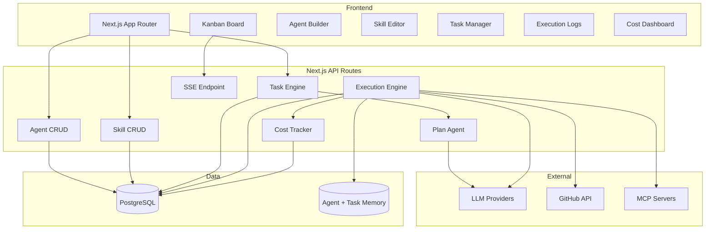
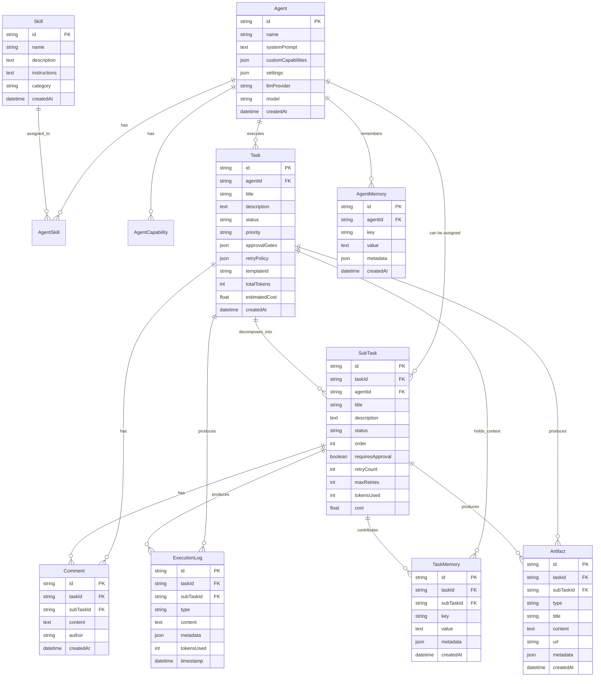

# AgentForge — Implementation Plan

## Problem Statement

Build a web-based platform for creating, managing, and orchestrating AI agents that can execute medium-complexity tasks with human oversight. The platform enables defining agents with prompts/capabilities/skills, decomposing tasks into sub-tasks via a built-in planner agent, tracking progress on a Kanban board, and integrating with Git repos and MCP servers.

---

## Requirements

- Single-user (no auth initially)
- Agent Builder: system prompt, predefined capability toggles, custom capabilities (override priority + conflict warnings), assignable skills
- Skills Library: standalone reusable instruction templates, assignable to any agent
- Task System: Plan Agent auto-decomposes → user approves/edits → agent executes
- Kanban view for task/sub-task progress
- Human-in-the-loop: approval gates, comments, full intervention (pause/redirect/cancel/takeover)
- Repo Access: GitHub integration (clone, read, commit, create PRs)
- MCP Support: connect agents to MCP tool servers
- Agent Memory: persistent context across tasks
- Task Memory: persistent context across sub-tasks within a task
- Execution Logs/Trace view
- Task Templates for common workflows
- Agent Dry Run / Testing mode
- Notifications (webhooks/browser)
- User-provided LLM API keys
- Agent Collaboration: sub-tasks assignable to different agents with handoff
- Error Recovery: configurable retry + escalation to human
- Cost Tracking: token usage & estimated cost per task/agent
- Output Artifacts: collected outputs per task (PR links, files, reports)

---

## Tech Stack

| Layer | Technology |
|-------|-----------|
| Framework | Next.js (App Router) + TypeScript |
| Database | PostgreSQL + Prisma ORM |
| UI Components | shadcn/ui + Tailwind CSS |
| LLM Integration | Vercel AI SDK (provider-agnostic) |
| Real-time | Server-Sent Events |
| Git | Octokit (GitHub API) |
| MCP | MCP TypeScript SDK |
| Kanban DnD | dnd-kit |
| Font | Inter (next/font) |
| Theming | next-themes (dark/light/system) |
| Charts | Recharts |

---

## UI Design Direction

### Inspiration
- **Linear** — overall app feel: clean sidebar, smooth animations, balanced density, subtle borders/hover
- **Vercel** — dark mode treatment: elegant dark theme with good contrast
- **Supabase Dashboard** — data-heavy pages (traces, cost dashboard)

### Design System
- Theme: Dark + Light with system preference detection + manual toggle
- Colors: Neutral grays base, indigo primary accent, semantic status colors (green=success, amber=in-progress, red=failed, purple=awaiting approval)
- Typography: Inter font
- Layout: Fixed sidebar (collapsible) + main content area with max-width container
- Cards: Subtle border, slight shadow on hover, rounded-lg corners
- Spacing: 4px base unit, balanced density
- Animations: Subtle transitions on hover/focus, smooth page transitions, skeleton loaders
- Kanban: Cards with left-side color accent bar indicating status
- Forms: Clean single-column forms, inline validation, clear section groupings
- Empty states: Simple SVG illustration + CTA button

### Color Palette

**Light mode:**
- Background: white / gray-50
- Surface: white with gray-200 borders
- Text: gray-900 primary, gray-500 secondary
- Accent: indigo-600

**Dark mode:**
- Background: gray-950 / gray-900
- Surface: gray-900 with gray-800 borders
- Text: gray-100 primary, gray-400 secondary
- Accent: indigo-400

### Key UI Patterns
- Sidebar: App logo at top, nav items with icons (Agents, Skills, Tasks, Cost, Settings), collapsible to icon-only mode
- Agent cards: Name, model badge, capability icons, skill tags, status dot
- Task detail: Tabbed layout (Overview | Sub-tasks | Trace | Artifacts | Comments)
- Kanban: Horizontal scrolling columns, cards show agent avatar + title + priority + cost chip
- Modals: For quick actions (assign skill, add comment). Full pages for creation/editing
- Toasts: For success/error feedback on actions

---

## Architecture

---

## Data Model

### Prisma Schema Entities

- **Agent**: id, name, systemPrompt, customCapabilities (Json), settings (Json), llmProvider, model, createdAt, updatedAt
- **Skill**: id, name, description, instructions, category, createdAt, updatedAt
- **AgentSkill**: id, agentId (FK→Agent), skillId (FK→Skill), assignedAt
- **AgentCapability**: id, agentId (FK→Agent), name, type (predefined|custom), enabled, description, createdAt
- **Task**: id, agentId (FK→Agent), title, description, status (pending|planning|approved|in_progress|awaiting_approval|completed|failed|cancelled), priority (low|medium|high|critical), approvalGates (Json), retryPolicy (Json), templateId, totalTokens, estimatedCost, createdAt, updatedAt
- **SubTask**: id, taskId (FK→Task), agentId (FK→Agent, nullable), title, description, status, order, requiresApproval, retryCount, maxRetries, tokensUsed, cost, createdAt, updatedAt
- **ExecutionLog**: id, taskId (FK→Task), subTaskId (FK→SubTask), type (llm_call|tool_call|decision|error|retry|handoff), content, metadata (Json), tokensUsed, timestamp
- **Comment**: id, taskId (FK→Task, nullable), subTaskId (FK→SubTask, nullable), content, author, createdAt
- **AgentMemory**: id, agentId (FK→Agent), key, value, metadata (Json), createdAt, updatedAt
- **TaskMemory**: id, taskId (FK→Task), subTaskId (FK→SubTask), key, value, metadata (Json), createdAt
- **Artifact**: id, taskId (FK→Task), subTaskId (FK→SubTask, nullable), type (file|link|code_snippet|report|pr_link), title, content, url, metadata (Json), createdAt
- **TaskTemplate**: id, title, description, suggestedCapabilities (Json), defaultSubTasks (Json), defaultRetryPolicy (Json), category, createdAt
- **Settings**: id, key, value (encrypted for sensitive), type, createdAt, updatedAt

---

## Task Breakdown

### Task 1: Project Scaffolding & Database Setup

**Objective:** Set up the Next.js project with TypeScript, Tailwind, shadcn/ui, Prisma, and PostgreSQL. Establish the base layout with dark/light theme support.

**Implementation:**
- Install deps: prisma, @prisma/client, shadcn/ui, @dnd-kit/core, @dnd-kit/sortable, ai, @ai-sdk/openai, @ai-sdk/anthropic, octokit, next-themes, lucide-react, recharts, class-variance-authority, clsx, tailwind-merge
- Configure Prisma schema with ALL entities
- Set up PostgreSQL connection (DATABASE_URL env)
- Run `prisma migrate dev`
- App shell layout: sidebar (collapsible) with nav items using lucide icons
- next-themes for dark/light mode + system detection + manual toggle
- Configure Tailwind color palette (indigo accent, semantic status colors)
- Inter font via next/font
- Stub pages: /agents, /skills, /tasks, /cost, /settings
- ThemeToggle component in sidebar

**Demo:** App loads with Linear-inspired sidebar, theme toggle works, all routes render stub pages, DB connected with all tables.

---

### Task 2: Skills Library — CRUD & UI

**Objective:** Build the Skills module — create, list, edit, delete skills.

**Implementation:**
- API routes: GET/POST `/api/skills`, GET/PUT/DELETE `/api/skills/[id]`
- Skills list page (`/skills`): card grid with search + category filter, empty state
- Skill creation (`/skills/new`): form with name, description, instructions (markdown), category
- Skill edit (`/skills/[id]/edit`): same form, pre-populated
- Delete with confirmation dialog
- Toast notifications
- shadcn/ui: Card, Button, Input, Textarea, Select, Dialog, Badge, Toast

**Demo:** Create skills like "Write Unit Tests," see them in categorized card grid, search/filter, edit, delete.

---

### Task 3: Agent Builder — Core CRUD

**Objective:** Build agent creation with system prompt, predefined capabilities, custom capabilities with conflict detection.

**Implementation:**
- API routes: GET/POST `/api/agents`, GET/PUT/DELETE `/api/agents/[id]`
- Predefined capabilities: web_access, code_execution, file_system, git_operations, shell_access, mcp_tools
- Agent list page: cards with name, model badge, capability icons, skill tags
- Agent builder form: name, system prompt, LLM provider/model, capability toggles, custom capabilities with conflict warnings
- shadcn/ui: Card, Switch, Badge, Tooltip, Alert

**Demo:** Create agent "Code Reviewer" with capabilities, see conflict warning for overlapping custom capability.

---

### Task 4: Agent-Skill Assignment

**Objective:** Assign skills from library to agents.

**Implementation:**
- API routes: POST/DELETE `/api/agents/[id]/skills`
- Agent detail page: skills section with removable chips
- "Add Skill" modal with searchable list
- Agent list cards show skill tags
- shadcn/ui: Dialog, Command, Badge

**Demo:** Assign skills to agent, see as tags, remove, verify multi-agent assignment.

---

### Task 5: Settings — API Keys & Configuration

**Objective:** LLM API key management, GitHub token, model cost configuration.

**Implementation:**
- Settings stored encrypted in DB
- API routes: GET/PUT `/api/settings`
- Settings page: API key inputs (masked), test connection button, GitHub token, model cost rates table
- AES-256 encryption for sensitive values
- shadcn/ui: Input, Table, Button, Separator

**Demo:** Configure API key, test connection, see masked keys, edit cost rates.

---

### Task 6: Task Creation & Plan Agent Decomposition

**Objective:** Task creation + Plan Agent auto-decomposes into sub-tasks with agent collaboration.

**Implementation:**
- API routes: GET/POST `/api/tasks`, POST `/api/tasks/[id]/plan`, PUT `/api/tasks/[id]/approve-plan`
- Task creation form: title, description, agent, priority, retry policy
- Plan Agent: analyzes task, proposes sub-tasks with suggested agent assignments
- Plan Review page: edit/reorder/add/remove sub-tasks, reassign agents, approve
- shadcn/ui: Form, Select, Textarea, DragHandle, Badge

**Demo:** Create task, Plan Agent proposes sub-tasks with agent suggestions, user edits and approves.

---

### Task 7: Kanban Board for Task Progress

**Objective:** Kanban view with drag-and-drop, agent collaboration visibility.

**Implementation:**
- Columns: Pending | In Progress | Awaiting Approval | Completed | Failed | Cancelled
- @dnd-kit for drag-and-drop
- Cards: title, agent, priority badge, cost chip, sub-task progress
- Filter by agent, priority
- Toggle Kanban/List view
- shadcn/ui: Card, Badge, Progress, DropdownMenu

**Demo:** Tasks across columns, drag to change status, filter, see sub-task progress.

---

### Task 8: Execution Engine — Core Loop

**Objective:** Execute agent tasks with task memory, cost tracking, error recovery, artifacts.

**Implementation:**
- `lib/execution-engine.ts`: loads agent config + skills + task memory → LLM call → log → store memory → collect artifacts
- Error recovery: retry with exponential backoff → escalate to human
- Agent handoff: TaskMemory passes between different agents on sub-tasks
- SSE endpoint for real-time updates
- Built-in tools: read_file, write_file, execute_command, search_code
- Vercel AI SDK: `streamText()` with tools

**Demo:** Execute sub-task with streaming output, task memory flows between sub-tasks, failure → retry → escalation.

---

### Task 9: Human-in-the-Loop

**Objective:** Approval gates, comments, intervention (pause/redirect/cancel/takeover).

**Implementation:**
- Approval gates: sub-task pauses at "awaiting_approval"
- Comments: markdown thread, guidance comments loaded into agent context
- Intervention: pause, resume, cancel, redirect (edit while paused)
- Task detail page: tabbed layout (Overview | Sub-tasks | Trace | Artifacts | Comments)
- Error escalation UI: retry, redirect, reassign, skip options
- shadcn/ui: Tabs, Textarea, Button, Alert, ScrollArea

**Demo:** Agent pauses at gate, user comments + approves. Agent fails → escalates → user redirects.

---

### Task 10: Execution Trace & Cost Dashboard

**Objective:** Detailed trace view + cost tracking dashboard.

**Implementation:**
- Trace timeline: LLM calls, tool calls, decisions, errors, retries, handoffs with icons
- Filter by type, sub-task. Token counts per step.
- Cost Dashboard (`/cost`): summary cards, time chart (recharts), per-agent table, per-task table, model breakdown
- API routes: GET `/api/cost/summary`, `/api/cost/by-agent`, `/api/cost/by-task`, `/api/cost/timeline`

**Demo:** View trace with all step types, check cost dashboard with breakdowns.

---

### Task 11: Output Artifacts

**Objective:** Artifact collection and display.

**Implementation:**
- Auto-collection during execution (files, URLs, code, PRs)
- Manual artifact attachment
- Artifacts tab: grouped by type, syntax highlighting, preview
- Kanban badge showing artifact count
- API routes: GET/POST `/api/tasks/[id]/artifacts`, DELETE `/api/artifacts/[id]`

**Demo:** Task produces artifacts auto-collected + manual, displayed grouped with previews.

---

### Task 12: GitHub Integration

**Objective:** Connect agents to GitHub repos.

**Implementation:**
- Repo configuration in Settings (GitHub token, select repos)
- Octokit tools: list_files, read_file, create_branch, commit_file, create_pr, read_issue
- PR links auto-collected as artifacts
- Only agents with `git_operations` capability can use GitHub tools

**Demo:** Agent reads repo, commits fix, opens PR. PR link in artifacts.

---

### Task 13: MCP Server Support

**Objective:** Connect agents to MCP tool servers.

**Implementation:**
- MCP config UI: add server URL/command, name
- MCP TypeScript SDK for tool discovery
- Agent config page shows available MCP tools
- MCP tools callable during execution alongside built-in tools
- Graceful connection error handling

**Demo:** Connect MCP server, agent discovers and uses tools during execution.

---

### Task 14: Agent Memory — Cross-Task Persistence

**Objective:** Long-term agent memory across tasks.

**Implementation:**
- AgentMemory table: key-value with metadata
- After task: extract learnings → store
- Before task: load relevant memories into context (keyword matching)
- Memory management UI on agent detail page
- Memory tokens tracked in cost

**Demo:** Agent remembers code patterns from previous task, uses in new task.

---

### Task 15: Task Templates

**Objective:** Pre-built and custom task templates.

**Implementation:**
- Template model with variables, default sub-tasks, retry policy
- Seed templates: "Review PR," "Write Tests," "Refactor File," "Document Codebase," "Fix Bug"
- Template selector on task creation
- "Save as Template" on completed tasks

**Demo:** Select template, fill variables, create task. Save custom template.

---

### Task 16: Notifications & Agent Dry Run

**Objective:** Browser notifications + dry-run mode.

**Implementation:**
- Browser Notification API: task complete, approval needed, errors, cost threshold
- Webhook support: configurable POST URL
- Dry Run: "Test Agent" button → simulates execution, shows plan + estimated cost without executing
- Preview panel for dry run results

**Demo:** Dry run shows planned approach + cost estimate. Webhook notifies on task completion.

---

### Task 17: Polish & End-to-End Integration

**Objective:** Error handling, loading states, e2e testing, UX polish.

**Implementation:**
- Error boundaries, retry logic, loading skeletons
- Empty states with CTAs
- Full e2e test: create agent → assign skills → create task → plan → approve → execute → approval gate → comment → artifacts → complete → trace
- Edge cases: LLM timeouts, rate limits, MCP drops
- Responsive design

**Demo:** Complete e2e workflow with all features working together.
